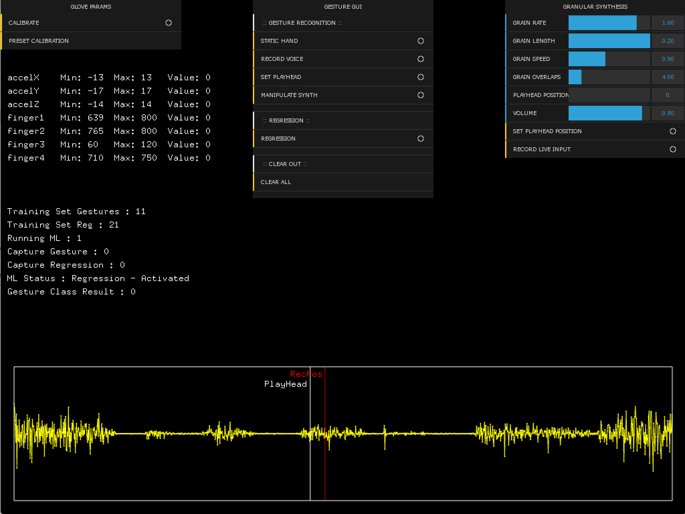

# Creative Machine Learning - Mini Project - Terry Clark 

## Description
I created a data glove to interact with a live audio granular synthesiser. I wanted to learn more about signal processing and physical computing. I was also interested to work with conductive material to capture the finger flexing.

## Components used
- Circuit Playground
- Conductive Material
- ofxRapidLib for Machine Learning (KNN and Regression via Neural Network)

## Re-used Code
- Main granularsynthesis code came from [Joshua Batty's](https://github.com/JoshuaBatty/LiveAudioGranularSynthesis-Maxim) Live audio Granular Synth
- Updated for OFX 0.9.4
- Updated Gui to ofxDatGui

## How to Compile
- Install all addons in addon.make
- Use openFrameworks 0.9.4 and project generator

## How to Use

### Glove Calibration
You can calibrate glove yourself or use some rough estimated values using the **Glove Gui**.

### Gesture Creation
The **Gesture Gui** gives all of the Machine Learning options from the top
- **Static Hand** - Record the hand flat so to help stop other gesture triggering
- **Record Voice** - Activates live voice recording
- **Set Playhead** - Control the *PlayHead* with x-axis on the accelerometer
- **Manipulate Synth** - *Described Below accelerometer X, Y and Z are only used*
- **Gesture Train** - Trains the set of gesture - Only need to do this once all gestures are recorded
- **Gesture Run** - Deactivate all gestures before activating this. The KNN model will rn and classify your gestures.

*Note: Activate gesture toggles to record and deactivate to stop, make sure to deaactive before moving onto the next gesture*

### Manipulating the Synth

To do this first set the sliders of the synth to your desired sound, you might want to record a sound first by pressing the live record button. After the your desired sound is set hold you hand in the desired posture and follow the steps below. Repeat process as neccesary.

- **Regression Record** - Will record how your hand is being held useing the accelorometers
- **Regression Train** - Will train the Neural recorded examples
- **Regression Run** - Will run the neural network to apply regression on the *inputs* (Glove) and *outputs* (Granular synth Sliders).